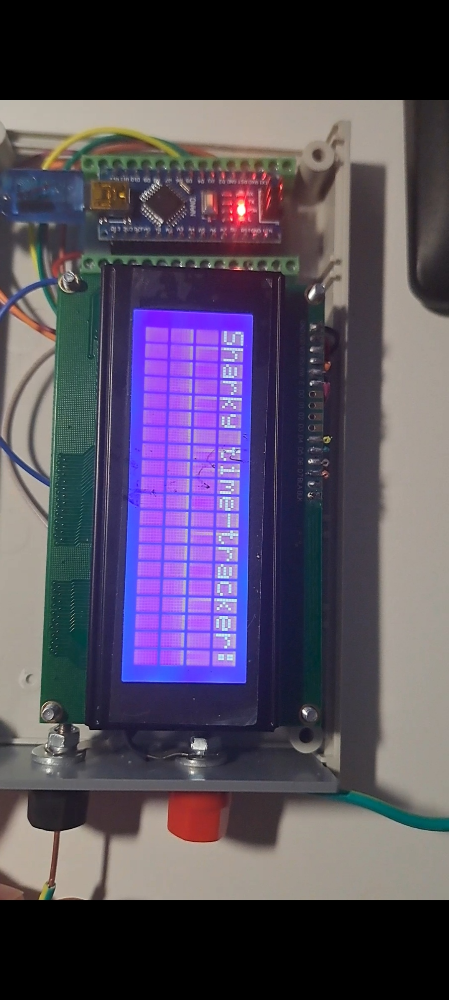
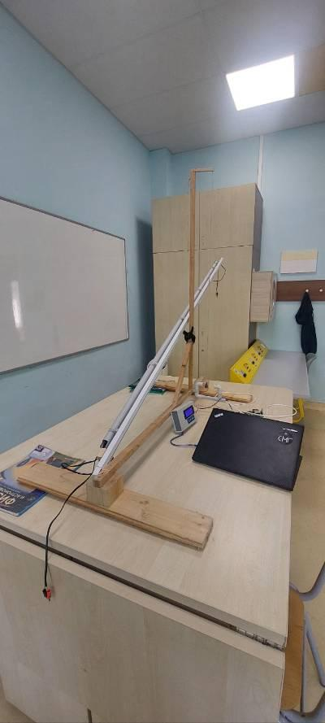

# Sharky time tracker

A lightweight Arduino-powered device for measuring precise time intervals between trigger events — 
created to help calculate Earth's gravitational acceleration for a high school experiment.


The tracker uses physical pin signals (*FIRE events*) to start, stop, or measure time. It features a simple UI on an LCD screen and is powered by a custom-assembled Arduino setup.


This repository contains the code for the machine; the hardware was also created by me with the help of my father.


This device was created for a school experiment. I donated it to the school, and my physics teacher
used the setup to demonstrate the concepts to younger students.

## 📸 Screenshots

| In progress | Finished setup |
|:----------------------:|:--------------------:|
|  |  |

## ⚙️ Tech stack
- Arduino
- C for software

## ⭐ Features
- 2-pin input system for flexible triggering. Independent of the actual type of trigger. In this setup, we used a photocell for one part of the experiment, and a simple pushing pin for the other.
- Real-time LCD for information on how time is going
- 3 triggering modes for extra flexibility:
 ```c
#define MODE1 1  // 1st FIRE event starts timer, 2nd FIRE event stops it
#define MODE2 2  // 1st FIRE event starts timer, all subsequent FIREs calculate time since start
#define MODE3 3  // 1st FIRE starts timer, all subsequent FIREs calculate lap time since last FIRE
```

