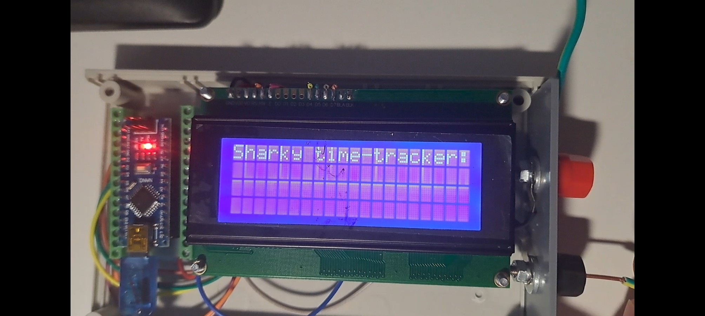

# Sharky Time Tracker ⏱️

A lightweight Arduino-powered device for measuring precise time intervals between trigger events — originally created to help calculate Earth's gravitational acceleration through a high school experiment.

---

## 📦 Project Overview

**Sharky Time Tracker** uses physical pin signals (*FIRE events*) to start, stop, or measure time. It features a simple UI on an LCD screen and is powered by a custom-assembled Arduino setup.

Built together with my father, this device later evolved into an educational tool now used by physics teachers to demonstrate motion, time, and gravity concepts to younger students.

---

## 🧠 Mode Logic

```c
#define MODE1 1  // 1st FIRE event starts timer, 2nd FIRE event stops it
#define MODE2 2  // 1st FIRE event starts timer, all subsequent FIREs calculate time since start
#define MODE3 3  // 1st FIRE starts timer, all subsequent FIREs calculate lap time since last FIRE
```
🔥 A FIRE event is a signal triggered via physical pin activation — e.g., a button press or sensor pulse.

---
## 🛠️ Hardware & Features
🔌 Arduino microcontroller

📺 LCD display for real-time timer feedback

🎛️ Two-pin input system for flexible triggering

🔄 Three programmable modes for different timing behaviours

---
## 🎯 Use Case & Real-World Application
Originally designed for a physics experiment to measure gravitational acceleration, the device was later:

💡 Donated to my school’s physics lab

👨‍🏫 Used by teachers to demonstrate physics concepts to 8th and 9th graders

---
## 🤝 Credits
Developed and assembled by Dragostin Ivanov, with hardware help from my father

Inspired by a school project and driven by a passion for learning and sharing science
--
## 📷 Gallery
Sharky in development:

